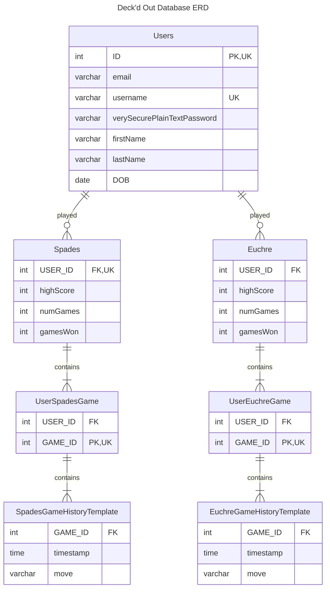
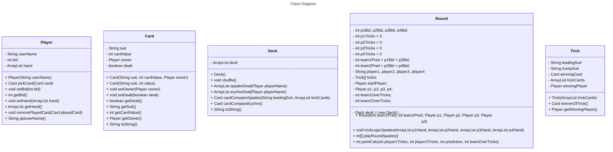

# Requirements and Specification Document

## TeamName

Deck’d Out

### Project Abstract

<!--A one paragraph summary of what the software will do.-->

This application will be a graphical user interface that will act as a hub for the user to access the two card games that we are developing: spades and euchre. Our application will allow the user to play the different card games while keeping track of the score. There will also be user profiles, which will track user high scores and will be able to rank the users against each other. 

### Customer

<!--A brief description of the customer for this software, both in general (the population who might eventually use such a system) and specifically for this document (the customer(s) who informed this document). Every project will have a customer from the CS506 instructional staff. Requirements should not be derived simply from discussion among team members. Ideally your customer should not only talk to you about requirements but also be excited later in the semester to use the system.-->

In terms of the population who might eventually our system, I would say that for the most part it would be used by younger or middle-aged working men and women who enjoy card games, but are not intense enough to play at weekly in-person meetings. Then again, those intense individuals could also use our app and compete with others via the ranking system. I feel that much older and younger individuals will likely either not understand or have access to the required technology to run our application, though technology like this is becoming more accessible every day.

### User Requirements

<!--This section lists the behavior that the users see. This information needs to be presented in a logical, organized fashion. It is most helpful if this section is organized in outline form: a bullet list of major topics (e.g., one for each kind of user, or each major piece of system functionality) each with some number of subtopics.-->

| ID   | Description                                                  | Priority | Status |
| ---- | ------------------------------------------------------------ | -------- | ------ |
| R11  | When the user first opens the application or when the user logs out, the frontend SHALL display the login page. | Med      | Open   |
| R12  | When the user clicks on the sign in button after entering their valid username and password on the login page, the frontend SHALL display the game lobby page. | Med      | Open   |
| R13  | When the user clicks on the "Join Now" button on the login page, the frontend SHALL display the register page. | Med      | Open   |
| R14  | When the user clicks on the profile button on any screen that is appears, the frontend SHALL display the profile page. | Med      | Open   |
| R15  | When the user clicks on the settings button on any screen that is appears, the frontend SHALL display the settings page. | Med      | Open   |
| R16  | On the game lobby page, when the user selects a game to play, the frontend SHALL display the game in question, and the backend SHALL begin the repsective game() method. | Med      | Open   |
| R17  | When the user clicks on the leaderboard button, the frontend SHALL display a leaderboard containing the user's score compared to the scores of other registered users. | Med      | Open   |
| R18  | When the user clicks on the home button (top left, in the form of the logo), the frontend SHALL display the game lobby home screen. | Med      | Open   |
| R19  | When the user selects a card to play, the card will be inserted into the trick, the card will be removed from the user's hand of cards, and the correct winner of the trick will be determined by the backend logic. | Med      | Open   |
| R20  | When the winner of a trick is determined, the application will display who won the trick to the user. | Med      | Open   |
| R21  | After a round of spades, the correct number of points will be calculated and added to each teams total, and if one team has over 500 points then they will be declared the winner of the game. | Med      | Open   |
| R22  | [GENERAL REQ] When the user begins a game of spades, the game logic defined in the backend SHALL be correctly implemented and allow for a legal game of spades to be played. | Med      | Open   |
| R23  | Users should be able to sign into the application with an account and access their high scores. | Med      | Open   |
| R24  | Users should be able to play the specified card games against other players. | High     | Open   |
| R25  | There should be a ranking system that compares the user's scores to other player's scores. | Med     | Open   |
| R26  | The user should be able to access a hub that will allow them to pick the card game that they want to play. | High      | Open   |
| R27  | The logic of each card game should work properly, and allow for a winner and a loser, as well as correct scoring. | Med     | Open   |
| R28  | Application UI should be as accessible and clear, with no confusing buttons or settings. | High     | Open   |

### Use Cases & User Stories

<!--Use cases and user stories that support the user requirements in the previous section. The use cases should be based off user stories. Every major scenario should be represented by a use case, and every use case should say something not already illustrated by the other use cases. Diagrams (such as sequence charts) are encouraged. Ask the customer what are the most important use cases to implement by the deadline. You can have a total ordering, or mark use cases with “must have,” “useful,” or “optional.” For each use case you may list one or more concrete acceptance tests (concrete scenarios that the customer will try to see if the use case is implemented).-->

As a user, I want to log into the card app using a username and password so that I can access the features available to my account.

As a user, I want to be able to use the graphical user interface (GUI) to select the mode of operation.

As a user, I want to be able to use the GUI to view all the past card games I played while logged into my account.

As a user, while viewing past card games, I want the application to show the optimal move for any given card hand, based only on the information known to the player.

As a user, I want to play a legal game of Euchre against a computer player.

As a user, I want to play a legal game of Spades against a computer player.

As a user, I want the card application to prevent me from making an illegal move.

As a user, I want to play a legal game of Euchre against a human player over the internet.

As a user, I want to play a legal game of Spades against a human player over the internet.

As a user, I want to be able to view my game statistics, including the number of wins and losses in each card game.

As a user, I want to my game statistics to update after I play games. 

As a user, I want to be able to view a leaderboard to see how I rank against other players.

As a user, I want to be able to view my leaderboard rank update as I play more games against other players.

As a user, I want to be able to navigate betwee screens.

### User Interface Requirements

<!--Describes any customer user interface requirements including graphical user interface requirements as well as data exchange format requirements. This also should include necessary reporting and other forms of human readable input and output. This should focus on how the feature or product and user interact to create the desired workflow. Describing your intended interface as “easy” or “intuitive” will get you nowhere unless it is accompanied by details.-->

<!--NOTE: Please include illustrations or screenshots of what your user interface would look like -- even if they’re rough -- and interleave it with your description.-->

Images can be included with ``

### Security Requirements

<!--Discuss what security requirements are necessary and why. Are there privacy or confidentiality issues? Is your system vulnerable to denial-of-service attacks?-->

| ID   | Description                                                  | Priority | Status |
| ---- | ------------------------------------------------------------ | -------- | ------ |
| R11  | Users should be able to safely input their username and password and know it is protected. | Med      | Open   |
| R12  | Users should be able to log into their account anytime they wish assuming they have the correct password. | High     | Open   |
| R13  | Incorrect username / password pairs should be allowed to access accounts. | Med     | Open   |

### System Requirements

<!--List here all of the external entities, other than users, on which your system will depend. For example, if your system inter-operates with sendmail, or if you will depend on Apache for the web server, or if you must target both Unix and Windows, list those requirements here. List also memory requirements, performance/speed requirements, data capacity requirements, if applicable.-->

| ID   | Description                                                  | Priority | Status |
| ---- | ------------------------------------------------------------ | -------- | ------ |
| R11  | We are targeting Windows users with our application. | Med      | Open   |

### Specification

<!--A detailed specification of the system. UML, or other diagrams, such as finite automata, or other appropriate specification formalisms, are encouraged over natural language.-->

<!--Include sections, for example, illustrating the database architecture (with, for example, an ERD).-->

<!--Included below are some sample diagrams, including some example tech stack diagrams.-->

Database architecture found below!

Technoloy Stack also found below!

#### Technology Stack

User Interface Frontend:
- Technologies: JavaScript, Maven
- Purpose: This layer handles the presentation and interactivity with the user, delivering a responsive and accessible experience.

Backend:
- Technologies: Java
- Purpose: The backend serves as the bridge between the frontend and the game engine, handling requests, and processing the game logic.

Game Engine:
- Technologies: Java 
- Purpose: The core of the game's operation, managing game state, enforcing rules, and running the main game loop.

Game Logic:
- Technologies: Java 
- Purpose: Implements the specific rules and mechanics of each game (Euchre, Spades), including scoring calculations and decision-making.

Networking:
- Technologies: Java sockets for network communication, and Java RMI (Remote Method Invocation) for distributed object applications.
- Purpose: To handle multiplayer interactions, synchronization of game state across clients, and to facilitate communication with the backend for authentication and database interactions.

User Authentication:
- Technologies: JSON Web Tokens (JWT) 
- Purpose: To securely identify users and manage sessions, ensuring that users can securely log in and interact with the system.

Database:
- Technologies: SQL Database ( MySQL or NoSQL)
- Purpose: To store user information, game states, scores, and potentially complex game-related data structures.

Score Calculation (Specific to Each Game):
- Technologies: Java 
- Purpose: To calculate and maintain scores based on the rules of Euchre and Spades, respectively. 

#### Database

#### Class Diagram

#### Flowchart

#### Behavior

#### Sequence Diagram

#### System Architecture Diagram

<!-- May need to actually draw this using something like mermaid for the README-->

### Standards & Conventions

<!--Here you can document your coding standards and conventions. This includes decisions about naming, style guides, etc.-->

Coding Standards Document
This document serves as the complete definition of L3-33’s coding standards for source code in the Java programming language.
External Resource: Oracle’s Javadoc 
Heavily references: Java Coding Standard
—
Identifier Naming and Capitalization
Use descriptive names for all variables, function names, constants, and other identifiers.
Use single letter identifiers only for the counter in loops.
Class names use PascalCase.
Variable names use camelCase.
Variables include parameters, local variables, and data fields.
EXCEPTION: use UPPER_CASE for constants/final variables.
Method names use camelCase.
The source file name consists of the case-sensitive name of the top-level class it contains, plus the .java extension

Comments: Classes
Every class should be preceded with a descriptive comment using the Javadoc notational convention.
The comment should describe the purpose of the class.
Class names start with an uppercase letter (as mentioned above).

Comments: Methods
Every method definition should be preceded with a descriptive comment using the Javadoc notational convention.
The comment should include a description of the method, the name and description of each parameter, a description of the return value, and the name and description of any exceptions thrown within the method using Javadoc keyboards and formatting.

Comments: Public variables
Each public variable should be preceded with a descriptive comment using the Javadoc notational convention.
The comment should describe the purpose for the public variable.

Comments: In-line
In-line comments should be used to explain complicated sections of code, such as loops.
Use the // comment delimiter for in-line comments.
Do not comment on generally known features of the Java language.

Spacing: Between lines
Use two blank lines to separate each method within a class definition.
Use one blank line to separate logical sections of code within a method

Spacing: Within lines
Put a single space before each ‘{‘.
Separate all binary operators, such as ‘+’, ‘-’, ‘*’, ‘/’, ‘%’, etc., with a single space.
EXCEPTION: unary operators such as ‘++’, ‘--’, etc.

Indentation
Open braces do not start a new line.
Close braces do start a new line, and are indented with the code they close.
Comments line up with the block they comment.

Program Modules
Lines of code should be kept short, generally less than 80 or 100 characters wide.
Each public class is contained in a separate file.
Each file has the name of the public class contained within it.
